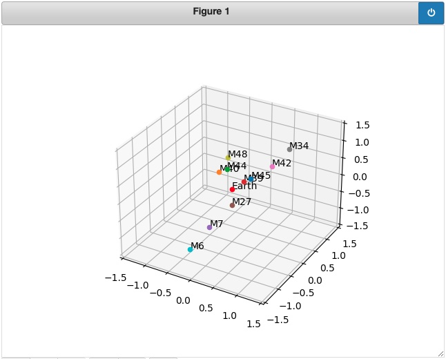

# Messier Objects Map
Python notebook which shows the 10 nearest Messier objects as a 3D plot

This project renders natively on GitHub, but if you run in Jupyter notebook, zooming and rotating the plot should work.

